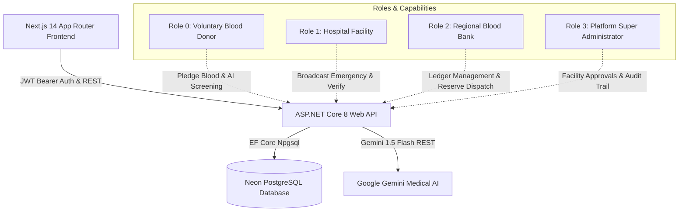

# 🩸 BloodNetwork — Enterprise Blood Management & Transfusion Coordination System

An enterprise-grade, clinical-compliance blood management and transfusion coordination platform built with **Next.js 14+ (App Router)**, **ASP.NET Core 8 Web API**, **PostgreSQL (Neon DB)**, and **Google Gemini AI Medical Triage**.

---

## 🌟 System Overview & High-Level Architecture

BloodNetwork connects emergency hospital trauma departments, certified regional cryo-depots (blood banks), and voluntary blood donors into a unified, secure, real-time transfusion grid.



---

## 🛡️ Strict Role-Based Access Control (RBAC)

| Role | Name | Permissions & Domain Isolation | Prohibited Actions |
|---|---|---|---|
| **Role 0** | **Blood Donor** | Complete AI medical screening, view **only active** emergency blood requests, pledge blood donations with ETA, track verified history, impact stats, and AI health badges. | Cannot broadcast requests; cannot view facility inventories; cannot access admin routes. |
| **Role 1** | **Hospital Facility** | Broadcast emergency requests, manage own requests (toggle active/closed), monitor live incoming pledges feed, and execute **Confirm Donation Received** (verifies donation, increments fulfilled count, auto-closes if target reached, writes to donor profile, logs to audit trail). | Cannot view general system stock matrices; cannot edit other hospitals' requests. |
| **Role 2** | **Regional Blood Bank** | 8-group inventory ledger (A+, A-, B+, B-, AB+, AB-, O+, O-), inward intake & outward dispatch recording, low-stock alerts, direct reserve dispatch to hospital emergency requests, broadcast shortage needs. | Cannot access super administrator control hub; cannot delete entities. |
| **Role 3** | **Platform Super Administrator** | Dedicated `/admin` control hub, facility approval pipeline (auditing license/registration numbers), full entity CRUD (donors, hospitals, blood banks), searchable platform activity audit trail. | Cannot delete own admin account. |

---

## 🔬 AI Medical Screening Engine (Google Gemini)

- **Endpoint:** `POST /api/MedicalScreening/evaluate-donor`
- **Model:** Google Gemini 1.5 Flash (`gemini-1.5-flash`)
- **Clinical Rules:**
  - Evaluates complete blood count (CBC) metrics, hemoglobin levels, and symptom markers.
  - Normalizes baseline: If user selects **"Check Signs (No Report)"**, automatically assigns a healthy baseline (13.5 g/dL) unless physical anemia indicators (pale conjunctiva/gums, chronic fatigue, dyspnea) are flagged, preventing false 0 g/dL rejections.
  - Evaluates viral deferral windows: 6-month tattoo/body piercing deferral, endemic malaria travel windows, and chronic illnesses.
  - **Graceful Deterministic Fallback:** If Gemini API is unreachable or no API key is supplied, a deterministic clinical rules engine evaluates the donor, ensuring 100% uninterrupted uptime.

---

## 📊 Database Schema (PostgreSQL / EF Core)

The system isolates all enterprise entities in the PostgreSQL schema `bloodnetwork`:

1. **`Users`**: Id, FullName, Email (Unique), PasswordHash (BCrypt), Role (0-3), PhoneNumber, City, Address, BloodGroup, IsVerified, LicenseOrRegNumber, NotificationRadiusKm, CreatedAt.
2. **`BloodRequests`**: Id, CreatorId, BloodGroup, RequiredUnits, FulfilledUnits, Urgency (0=Critical, 1=Urgent, 2=Standard), PatientDiagnosis, WardOrBedNumber, ContactNumber, IsActive, CreatedAt.
3. **`BloodPledges`**: Id, RequestId, DonorId, UnitsOffered, EstimatedArrival, DonorContactNumber, Status, CreatedAt.
4. **`DonationHistories`**: Id, DonorId, FacilityId, BloodGroup, Units, ClinicalCase, DonationDate, VerificationCode (`BN-TX-YYYYMMDD-...`).
5. **`BloodInventoryItems`**: Id, FacilityId, BloodGroup, AvailableUnits, MinThresholdUnits, LastUpdated.
6. **`InventoryTransactions`**: Id, FacilityId, Type ("Intake" | "Dispatch"), BloodGroup, Units, SourceOrRecipient, Timestamp.
7. **`AuditLogs`**: Id, Action, ActorEmail, Details, Timestamp.

---

## 🔑 Pre-Seeded Demonstration Accounts

| Role | Email | Password | Details |
|---|---|---|---|
| **Super Admin** | `admin@bloodnetwork.org` | `Admin@123` | Full access to `/admin` control hub |
| **Hospital Facility** | `hospital@stjude.org` | `Password@123` | St. Jude Memorial Hospital (Verified) |
| **Hospital Facility** | `trauma@metrohealth.org` | `Password@123` | Metro Trauma Center (Verified) |
| **Pending Hospital** | `clinic@cityurgent.org` | `Password@123` | City Urgent Care Clinic (Pending Approval) |
| **Regional Blood Bank** | `bank@redcrossblood.org` | `Password@123` | Red Cross Central Blood Depot (8-group stock) |
| **Regional Blood Bank** | `depot@northblood.org` | `Password@123` | Northern Regional Blood Center |
| **Blood Donor (O+)** | `donor@bloodnetwork.org` | `Password@123` | Jane Doe (Verified history & badges) |
| **Blood Donor (A-)** | `marcus@donornet.io` | `Password@123` | Marcus Vance |

---

## 🚀 Local Development & Execution

### Backend (ASP.NET Core 8 Web API)
```bash
cd backend
dotnet restore
dotnet build
dotnet run
```
- API will start on: `http://localhost:5218`
- Interactive Swagger UI: `http://localhost:5218/swagger`

### Frontend (Next.js 14 App Router)
```bash
cd frontend
npm install
npm run dev
```
- Web Application will start on: `http://localhost:3000`

---

## ☁️ Zero-Touch Deployment to Render

The repository contains pre-configured deployment blueprints:

### 1. Multi-Stage Dockerfile (`backend/Dockerfile`)
Compiles the ASP.NET Core 8 Web API with SDK 8.0 and packages the final lightweight runtime image listening on port 10000.

### 2. Render Blueprint (`render.yaml`)
Automatically orchestrates:
- **`bloodnetwork-backend`**: Docker environment pointing to `backend/Dockerfile` with PostgreSQL connection string and JWT generation.
- **`bloodnetwork-frontend`**: Node environment pointing to `frontend` with automated `NEXT_PUBLIC_API_URL` service discovery.
